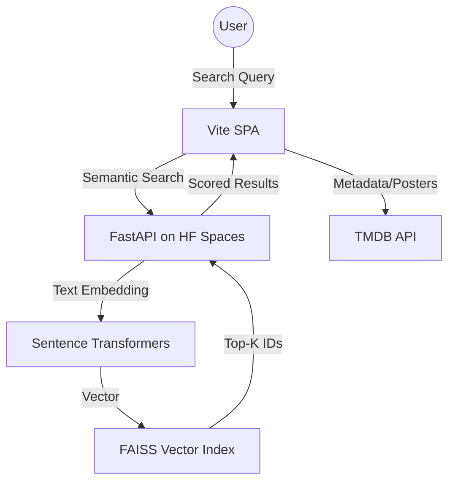

# SemRec: Semantic Movie Recommender

### 1. Project Title
**SemRec: Semantic Movie Recommender**

---

### 2. One-Line Project Summary
A next-generation movie discovery engine powered by natural language processing and FAISS vector embeddings to find films by "vibe" and "theme".

---

### 3. Live Demo Links
- **Frontend (Vercel)**: [https://sem-rec.vercel.app/](https://sem-rec.vercel.app/)
- **Backend API (Hugging Face)**: [Interactive Swagger UI](https://tytonterrapin-fine-tuned-semantic-movie-recommen-22f16c2.hf.space/docs)

---

### 4. Screenshots / GIF Preview


---

### 5. Problem Statement
Traditional movie search engines rely on rigid keyword matching (genre, actor, title). They fail to capture the nuanced "vibe" or complex thematic descriptions that users often use to describe what they want to watch (e.g., *"movies about existential dread in space but without jump scares"*).

---

### 6. Why This Project Matters
SemRec bridges the gap between human language and digital discovery. By using deep learning to map movies into a high-dimensional vector space, it allows for "vibe-based" retrieval that feels intuitive and personalized, moving beyond the simple filter-based discovery of modern streaming platforms.

---

### 7. Key Features
- **Semantic Vibe Search**: Describe your desired movie naturally.
- **Steerable Negation**: Tell the engine what you *don't* want to see, and it will mathematically repel those results.
- **Dynamic Catalog**: A curated mosaic of trending films populated in real-time.
- **Deep TMDB Integration**: Full metadata expansion, budget details, and casting info.
- **Inline Previewing**: Watch official YouTube trailers directly within the discovery flow.

---

### 8. Tech Stack
- **Frontend**: Vanilla JavaScript (ES6+), CSS Grid/Flexbox, Vite (Build Tool).
- **Backend**: Python, FastAPI.
- **ML/Search**: PyTorch, Sentence-Transformers (`all-MiniLM-L6-v2`), FAISS (Vector Retrieval).
- **Metadata**: TMDB API integration.

---

### 9. System Architecture Diagram


---

### 10. Frontend Architecture Overview
The frontend is built as a modular Single Page Application (SPA).
- `api.js`: Stateless network abstraction for both internal ML services and external TMDB APIs.
- `ui.js`: Dynamic DOM-builder that constructs complex cinematic layouts from JSON data.
- `store.js`: Lightweight local persistence for the user's Watchlist.

---

### 11. Backend Architecture Overview
A stateless FastAPI server handles the bridge between the client and the vector space. It is designed for horizontal scalability and low-latency inference, hosted on Hugging Face Spaces with T4 GPU access for high-speed embedding generation.

---

### 12. ML / Search Engine Overview
The system uses **FAISS (Facebook AI Similarity Search)** to perform millisecond-level retrieval. Movies are represented as **384-dimensional vectors** in a shared latent space where visual and thematic similarity are mathematically close.

---

### 13. Fine-Tuning Methodology
- **Loss Function**: `MultipleNegativesRankingLoss` (MNRL) for contrastive learning.
- **Scaling**: Temperature factor of `20.0` to sharpen similarity distributions.
- **Precision**: Mixed Precision (FP16) training to maximize throughput on Tesla T4 GPUs.

---

### 14. Dataset / Data Sources
The engine is pre-indexed on a dataset of **26,000+ movies** derived from the TMDB database, featuring fine-tuned embeddings that prioritize high-quality metadata and plot descriptions.

---

### 15. Query Processing Logic
Queries are passed through a custom parser that:
1.  Removes "hedges" (e.g., *"I'm looking for... "*).
2.  Identifies "negation markers" (e.g., *"but no..."*, *"without..."*).
3.  Splits intent into **Positive** and **Negative** components.

---

### 16. Embedding & Vector Search Flow
1. **User Prompt** $\rightarrow$ **Transformer Model** $\rightarrow$ **Search Vector**.
2. **Search Vector** $\rightarrow$ **FAISS IndexFlatIP** $\rightarrow$ **Nearest Neighbors Retrieval**.

---

### 17. Reranking Strategy
To ensure quality, retrieved results are reranked using a multi-factor scoring formula:
$$Score = 0.75 \cdot \text{SemanticSimilarity} + 0.15 \cdot \text{Popularity} + 0.10 \cdot \text{VoteAverage}$$

---

### 18. Negation / Advanced Query Handling
We implement "Steerable Vector Math" to handle exclusions:
$$Q_{vec} = \text{Normalize}(V_{pos} - \lambda \cdot \text{Mean}(V_{neg}))$$
Where $\lambda$ (Lambda) controls the strength of the repulsion.

---

### 19. API Endpoints Summary
- `GET /search`: Returns top semantic matches for a text string.
- `GET /similar/{id}`: Returns vector-close films for a specific movie ID.
- `POST /recommend_by_movie`: Generates recommendations for movies not in the local index.

---

### 20. Deployment Architecture
- **Frontend**: Vercel (Continuous Deployment from GitHub).
- **Backend/ML**: Hugging Face Spaces (GPU-backed Inference).

---

### 21. Performance Metrics
- **Retrieval Latency**: <50ms for FAISS search.
- **Encoding Speed**: ~60s to encode the entire library on T4 GPU.
- **High Recall**: Optimized Recall@K across multiple thematic benchmarks.

---

### 22. Challenges Faced
- **Metadata Cold Start**: Handling recommendations for brand-new movies not in the pre-computed index.
- **Negation Drift**: Steering the vector away from concepts without landing in relevant "garbage" space.

---

### 23. Optimizations Implemented
- **TF32 Acceleration**: Enabled for Ampere GPUs during training.
- **Cache Layer**: `Map`-based local caching for TMDB metadata to respect rate limits.

---

### 24. Installation Instructions
```bash
git clone https://github.com/your-repo/SemanticRecFrontend.git
cd SemanticRecFrontend
npm install
```

---

### 25. Local Development Setup
1. Create a `.env` file in the root.
2. Add `VITE_TMDB_KEY=your_tmdb_api_key`.
3. Run the development server:
```bash
npm run dev
```

---

### 26. Environment Variables Required
| Variable | Purpose | Location |
| :--- | :--- | :--- |
| `VITE_TMDB_KEY` | Fetches posters, trailers, and deep metadata | TMDB Developer Settings |

---

### 27. Project Folder Structure
```text
/SemanticRecFrontend
├── public/                 # Static assets
├── src/
│   ├── assets/             # Images and design docs
│   ├── api.js              # Network logic
│   ├── ui.js               # Component rendering
│   ├── store.js            # State management
│   └── main.js             # Bootstrap
├── .env.local              # Local keys (ignored)
├── index.html              # Entry point
└── package.json            # Deps & Scripts
```

---

### 28. Usage Examples
- **Descriptive Search**: *"Slow-paced investigative noir set in rainy cities"*
- **Negation Search**: *"Epic fantasy adventure but no dragons"*
- **Concept Discovery**: *"Movies that explore the simulation hypothesis"*

---
*Generated by SemRec Auto-Doc on April 21, 2026.*
