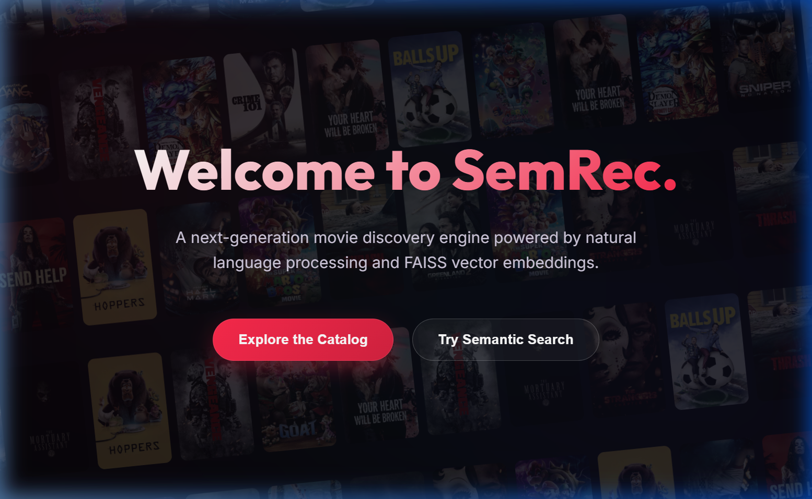
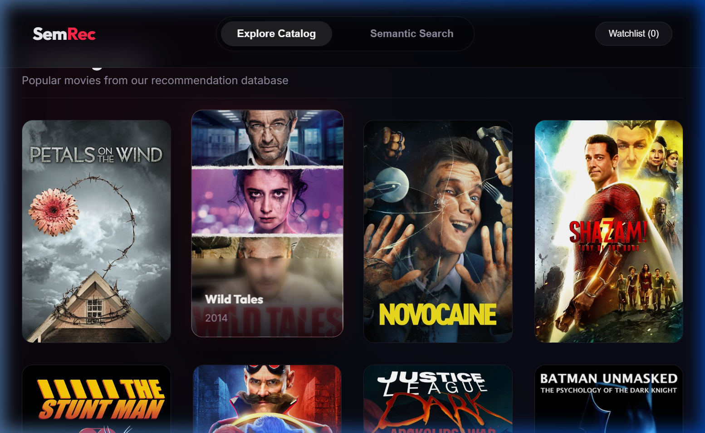
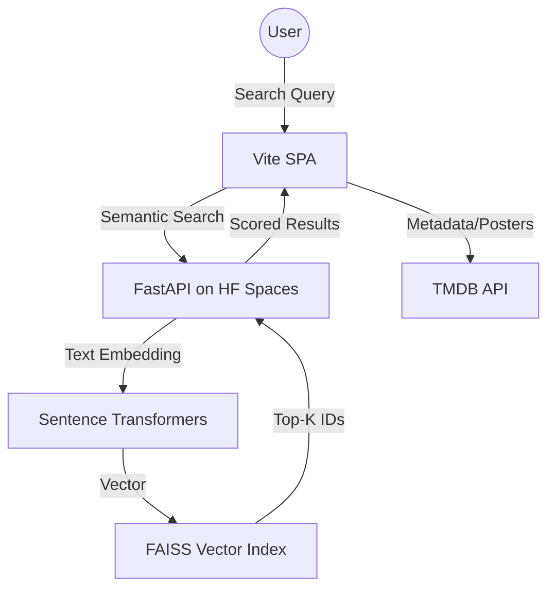
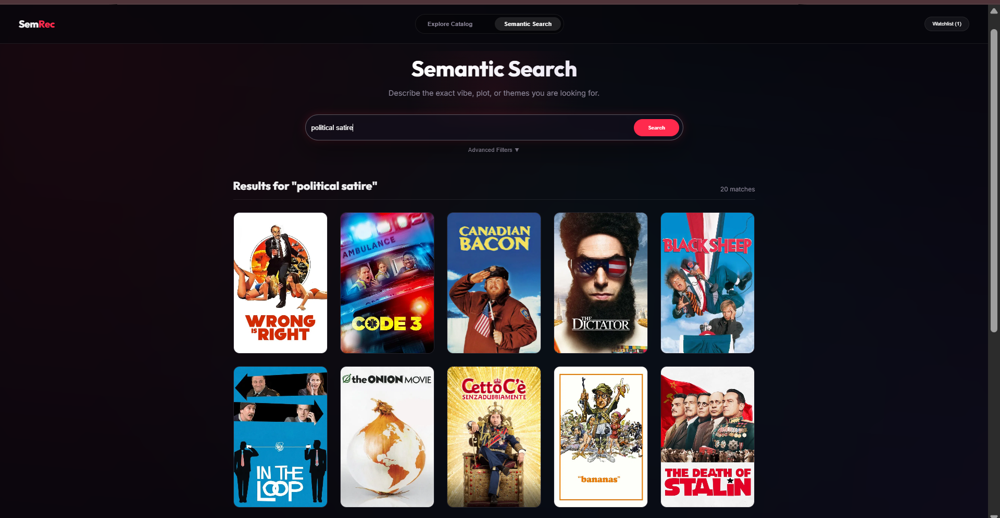
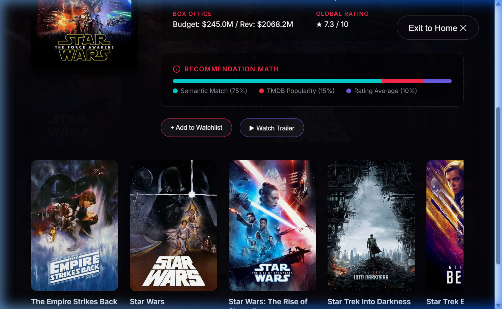

# SemRec — Semantic Movie Recommender

> Find films by *vibe*, not just keywords. SemRec uses natural language understanding and vector embeddings to match movies to the feeling you're chasing — including what you want to avoid.

**[Live Demo](https://sem-rec.vercel.app/)** · **[API Docs (Swagger)](https://tytonterrapin-fine-tuned-semantic-movie-recommen-22f16c2.hf.space/docs)**

---

## Table of Contents

1. [Overview](#overview)
2. [Features](#features)
3. [System Architecture](#system-architecture)
4. [ML & Search Engine](#ml--search-engine)
5. [API Reference](#api-reference)
6. [Getting Started](#getting-started)
7. [Deployment](#deployment)
8. [Performance](#performance)

---

## Overview

Most movie search tools are built around rigid filters — genre, actor, release year. They break the moment you try something like *"existential dread in space, but no jump scares"* or *"slow-burn investigative noir set in rainy cities"*.

SemRec is built around a different idea: encode the *meaning* of a movie into a high-dimensional vector, then retrieve films by semantic proximity to what a user describes. The result is a discovery experience that feels more like talking to a cinephile than querying a database. It's pre-indexed on **26,000+ movies** from TMDB, with a fine-tuned sentence transformer that prioritizes thematic and atmospheric nuance over surface-level metadata.



---

## Features

- **Semantic Vibe Search** — describe what you want to watch in plain English; the engine finds what matches.
- **Steerable Negation** — explicitly exclude unwanted elements (e.g. *"epic fantasy but no dragons"*); the query vector is mathematically steered away from those concepts.
- **Dynamic Catalog** — a real-time mosaic of trending films populated via TMDB.
- **Deep TMDB Integration** — full metadata including budget, cast, and poster art.
- **Inline Trailer Previews** — watch official YouTube trailers without leaving the discovery flow.



---

## System Architecture



**Frontend** is a modular Vanilla JS SPA built with Vite. Key modules: `api.js` (network abstraction for ML services + TMDB), `ui.js` (dynamic DOM rendering), `store.js` (watchlist persistence).

**Backend** is a stateless FastAPI server hosted on Hugging Face Spaces with T4 GPU access, designed for low-latency inference and horizontal scalability.

---

## ML & Search Engine

### Embedding & Retrieval

Queries and movie descriptions are encoded into **384-dimensional vectors** using a fine-tuned `all-MiniLM-L6-v2` sentence transformer. Retrieval is handled by **FAISS `IndexFlatIP`**, delivering sub-50ms nearest-neighbor search across the full index.

**Query Processing Pipeline:**
1. Strip hedges (e.g. *"I'm looking for..."*)
2. Identify negation markers (e.g. *"but no..."*, *"without..."*)
3. Split into positive and negative intent components
4. Encode each component separately

### Negation (Steerable Vector Math)

Exclusions are handled by repelling the query vector away from negative concepts:

$$Q_{vec} = \text{Normalize}(V_{pos} - \lambda \cdot \text{Mean}(V_{neg}))$$

$\lambda$ controls repulsion strength and is tunable per query.

### Reranking

Retrieved results are reranked with a blended scoring formula to balance semantic precision with popularity signals:

$$\text{Score} = 0.75 \cdot \text{SemanticSimilarity} + 0.15 \cdot \text{Popularity} + 0.10 \cdot \text{VoteAverage}$$

### Fine-Tuning Details

| Parameter | Value |
| :--- | :--- |
| Loss Function | `MultipleNegativesRankingLoss` (MNRL) |
| Temperature | `20.0` (sharpens similarity distributions) |
| Precision | Mixed Precision FP16 |
| Hardware | Tesla T4 GPU (TF32 enabled for Ampere) |



---

## API Reference

| Endpoint | Description |
| :--- | :--- |
| `GET /search` | Returns top semantic matches for a text query |
| `GET /similar/{id}` | Returns vector-close films for a given movie ID |
| `POST /recommend_by_movie` | Generates recommendations for movies not in the local index |

Full interactive documentation available at the [Swagger UI](https://tytonterrapin-fine-tuned-semantic-movie-recommen-22f16c2.hf.space/docs).



---

## Getting Started

### Prerequisites

- Node.js 18+
- A [TMDB API key](https://developer.themoviedb.org/)

### Installation

```bash
git clone https://github.com/your-repo/SemanticRecFrontend.git
cd SemanticRecFrontend
npm install
```

### Environment Setup

Create a `.env.local` file in the project root:

```env
VITE_TMDB_KEY=your_tmdb_api_key
```

### Run Locally

```bash
npm run dev
```

### Project Structure

```
/SemanticRecFrontend
├── public/             # Static assets
├── src/
│   ├── assets/         # Images and design docs
│   ├── api.js          # Network logic (ML + TMDB)
│   ├── ui.js           # Component rendering
│   ├── store.js        # Watchlist state
│   └── main.js         # App bootstrap
├── .env.local          # Local keys (gitignored)
├── index.html          # Entry point
└── package.json
```

---

## Deployment

| Layer | Platform | Notes |
| :--- | :--- | :--- |
| Frontend | Vercel | Continuous deployment from GitHub |
| Backend / ML | Hugging Face Spaces | GPU-backed (T4), auto-scaled inference |

---

## Performance

- **FAISS Retrieval Latency**: < 50ms
- **Full Library Encoding**: ~60s on T4 GPU
- **Index Size**: 26,000+ movies at 384 dimensions
- **Caching**: Map-based local cache for TMDB metadata to respect rate limits

### Known Challenges

**Metadata Cold Start** — movies not yet in the pre-computed index can't be retrieved via FAISS. The `/recommend_by_movie` endpoint handles this by embedding on-the-fly.

**Negation Drift** — steering the vector away from a concept can occasionally land in irrelevant semantic space. Lambda tuning and candidate filtering help mitigate this.

---

*SemRec — built for the moments when you know exactly how you want to feel, but not what to watch.*
