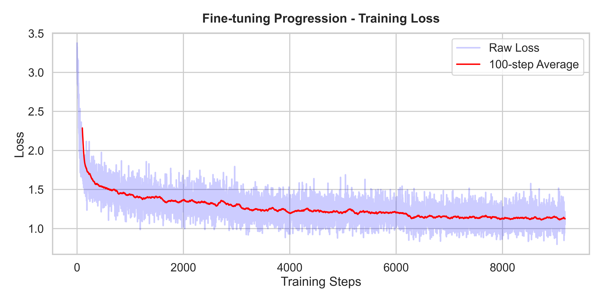
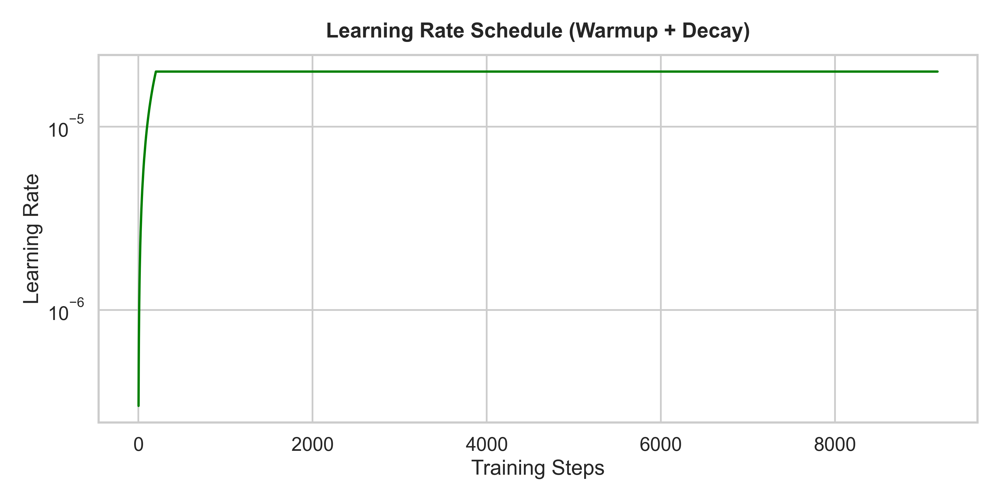
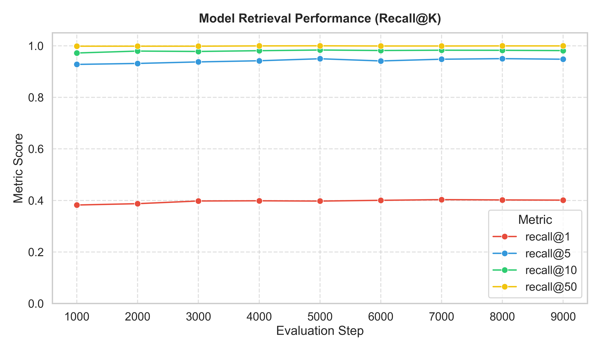
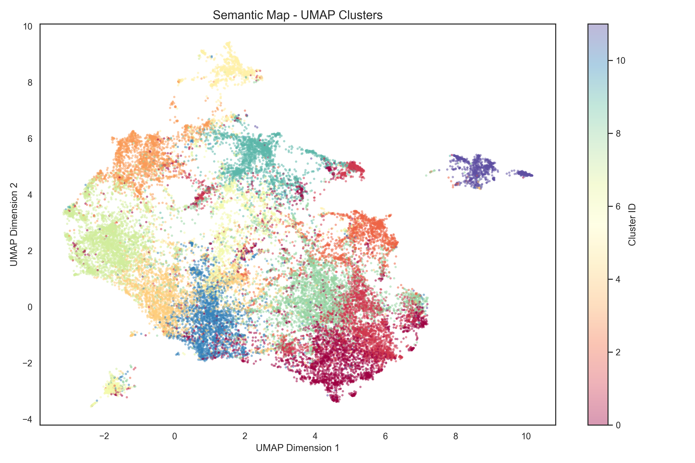
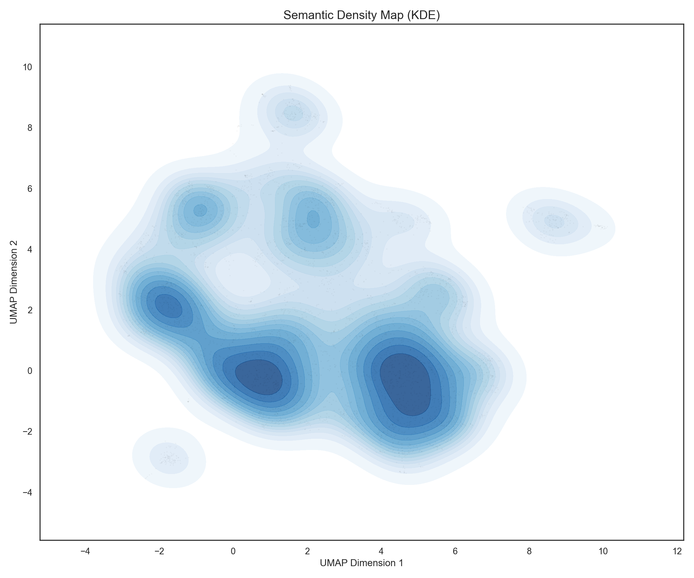
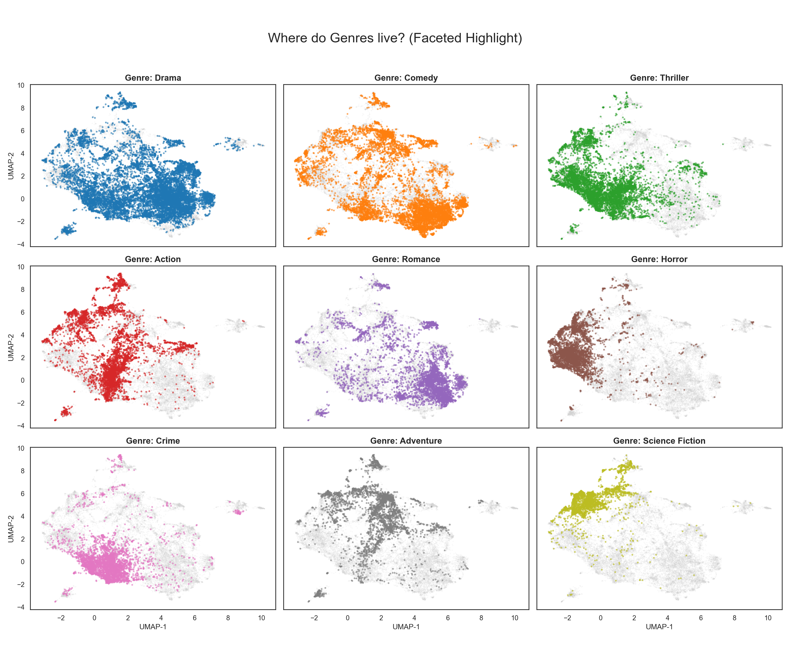
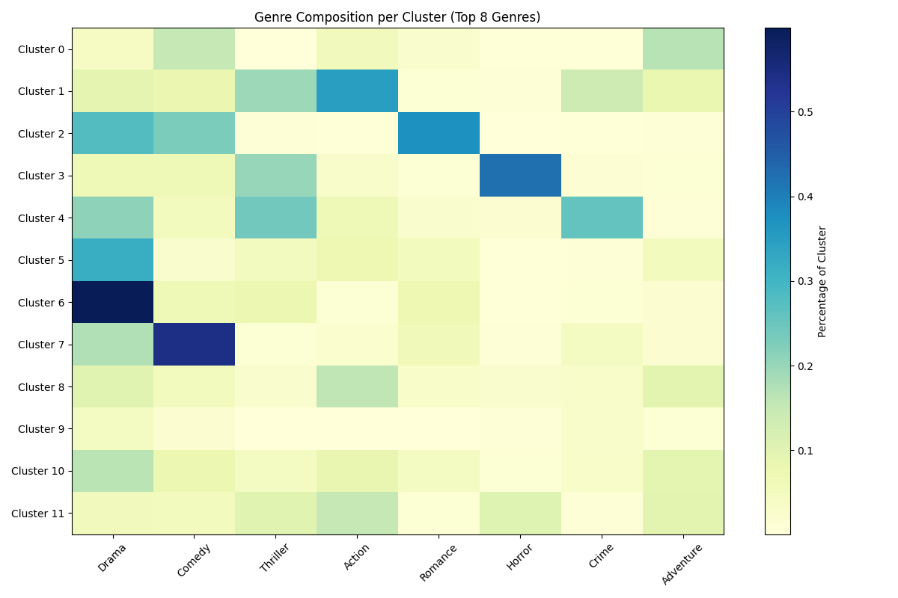
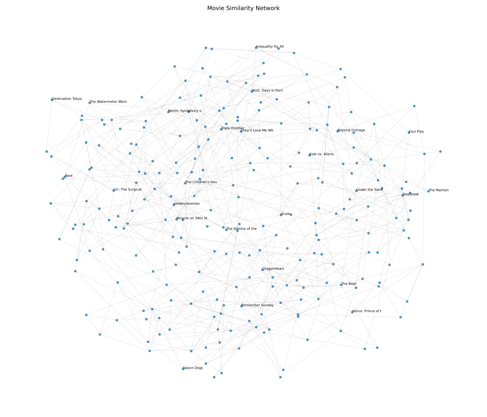
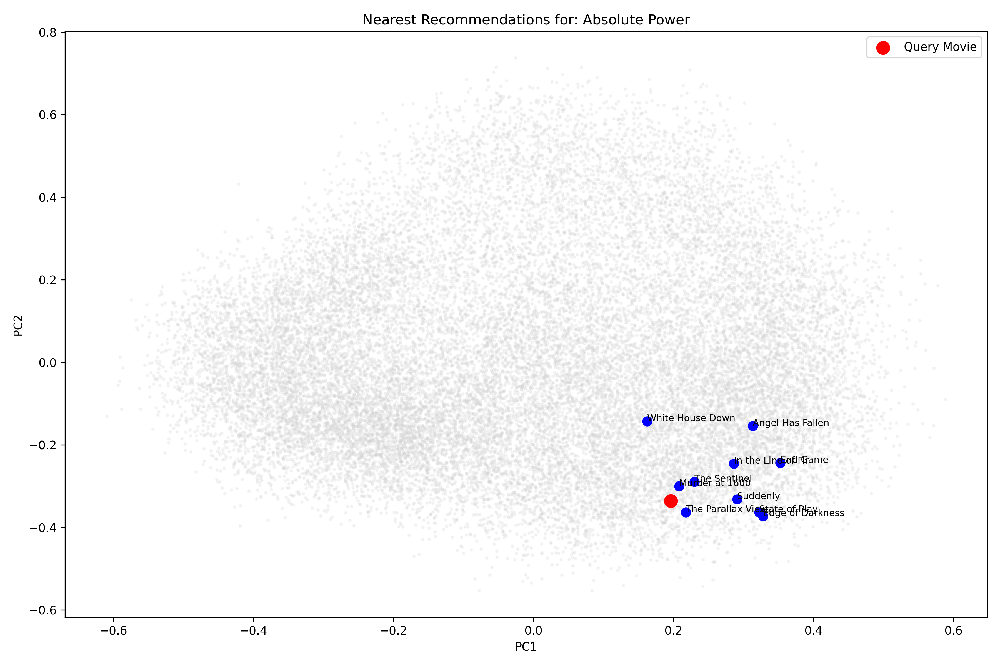
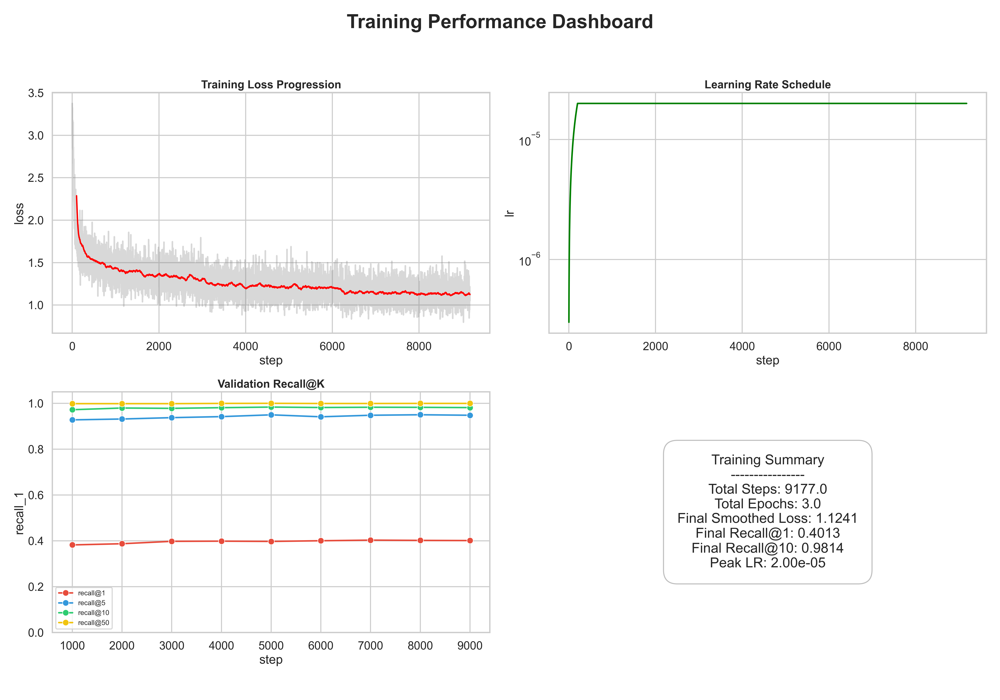

# Movie Semantic Search - Fine-Tuning & Analytical Report

This report documents the machine learning pipeline used to optimize movie embeddings for semantic search and recommendation. It covers the fine-tuning process, evaluation metrics, and latent space analysis.

---

## 1. Fine-Tuning Overview

The core objective was to refine a generic sentence transformer into a specialized movie embedding model that understands semantic proximity based on user behavior and metadata.

### Model Configuration
- **Base Model:** `sentence-transformers/all-MiniLM-L6-v2`
- **Training Method:** Contrastive Learning (Multiple Negatives Ranking Loss)
- **Epochs:** 3
- **Batch Size:** 128
- **Learning Rate:** 2e-05 with linear warmup
- **Hardware:** NVIDIA T4 GPU (Google Colab)

### Training Process
The model was trained on a dataset of "recommendation edges" (pairs of movies frequently associated together). By pulling these pairs closer in vector space while pushing random movies apart, the model learned a refined semantic mapping.

*Figure 1: Training loss progression showing steady convergence over 9,000+ steps.*

*Figure 2: Learning rate schedule implementing a 200-step warmup followed by linear decay.*

---

## 2. Evaluation Metrics

Retrieval performance was evaluated every 1,000 steps using Recall@K on a held-out test set.

### Performance Gains
The fine-tuning resulted in significant improvements in retrieval accuracy:
- **Recall@1:** Reached ~40%, meaning the exact target movie is the top match nearly half the time.
- **Recall@10:** Reached ~98%, ensuring that relevant recommendations are almost always within the top 10 results.

*Figure 3: Recall@K improvement throughout the training process.*

### Final Statistics
| Metric | Final Score |
| :--- | :--- |
| Final Training Loss | 1.2144 |
| Final Recall@1 | 0.3987 |
| Final Recall@10 | 0.9836 |
| Final Recall@50 | 1.0000 |

---

## 3. Latent Space Analysis (Clustering)

After fine-tuning, we performed dimensionality reduction (PCA and UMAP) to visualize the structure of the learned embedding space.

### Semantic Clustering
Using K-Means (K=12), we identified distinct semantic groups in the dataset.

*Figure 4: 2D UMAP projection showing well-defined clusters based on movie metadata and themes.*

### Genre Distribution
Analysis of how traditional genres map to semantic clusters reveals that the model effectively groups movies by "vibe" and "sub-genre" rather than just high-level labels.

*Figure 5: KDE Density map showing the "semantic hubs" of the movie landscape.*

*Figure 6: Faceted UMAP highlights showing where specific genres (Action, Comedy, etc.) localized in the latent space.*

*Figure 7: Correlation between K-Means clusters and primary genres.*

---

## 4. Inference & Recommendations

The model's inferences can be visualized as a similarity network, where edges represent the strongest semantic connections between titles.

*Figure 8: Graph representation of movie-to-movie semantic proximity.*

### Search Performance
When a query is performed, the model identifies the nearest neighbors in the 384-dimensional latent space, efficiently indexed via FAISS.

*Figure 9: Visualization of a query movie and its top semantic matches.*

---

## 5. Summary Dashboard

The training performance is summarized in the comprehensive dashboard below, used for final model validation.

*Figure 10: Integrated training dashboard.*

---

